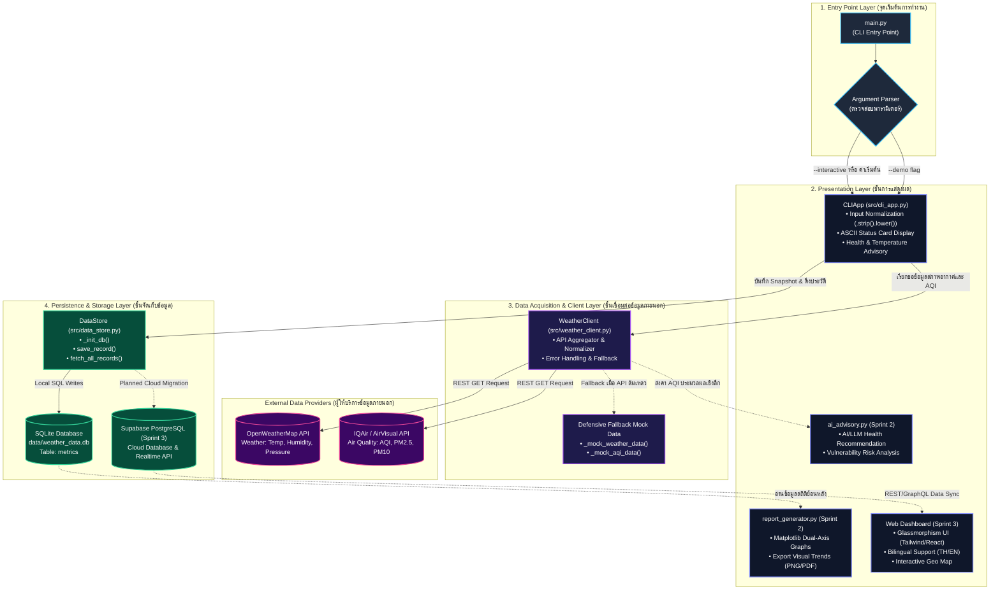
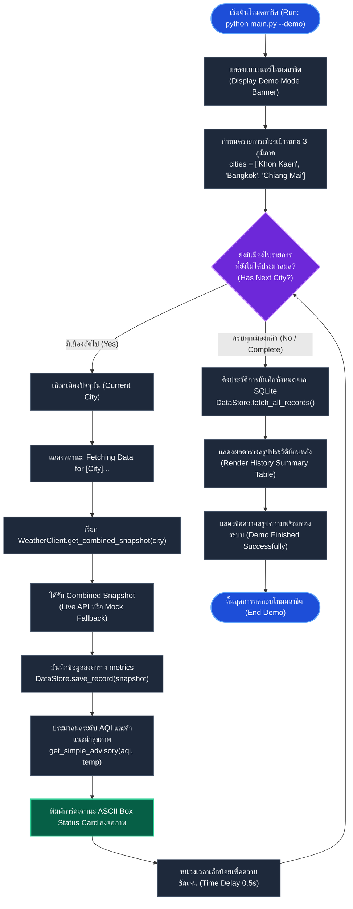
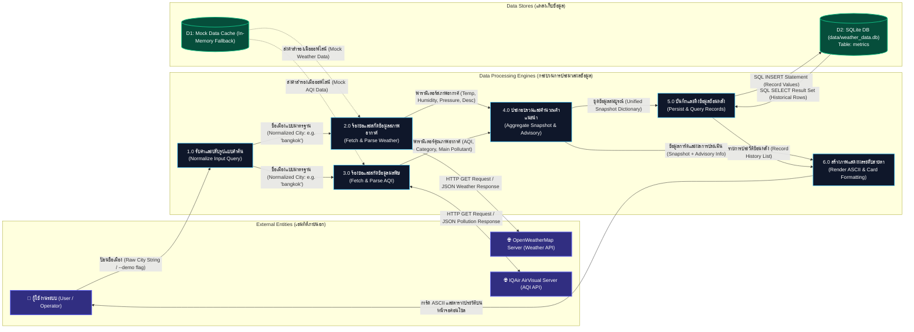
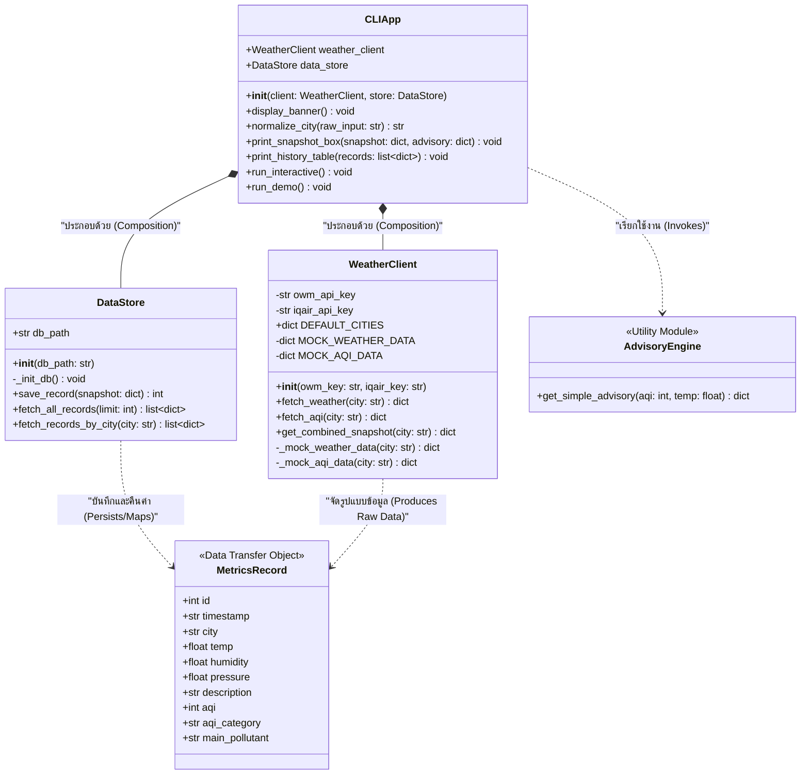
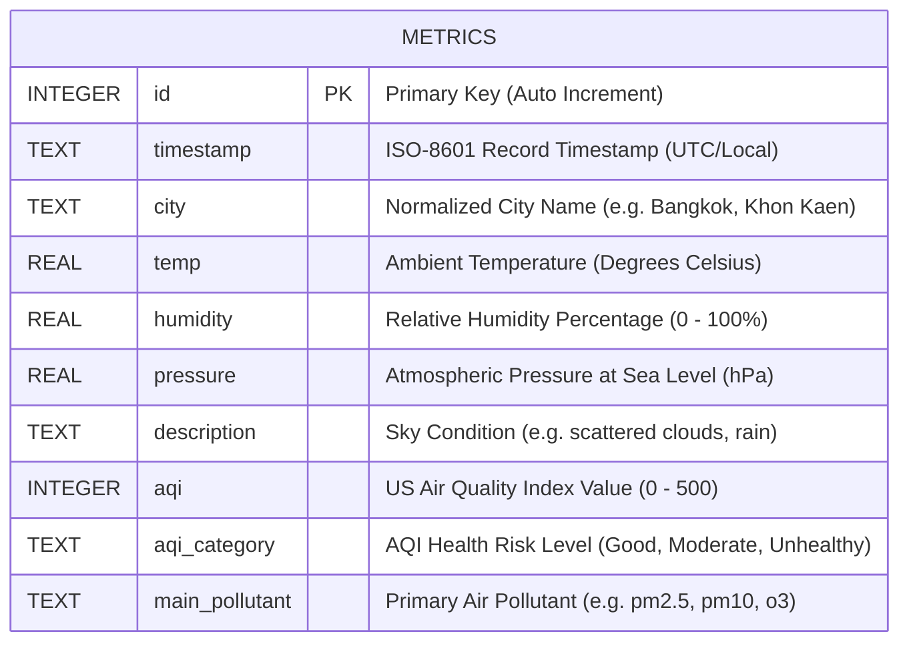
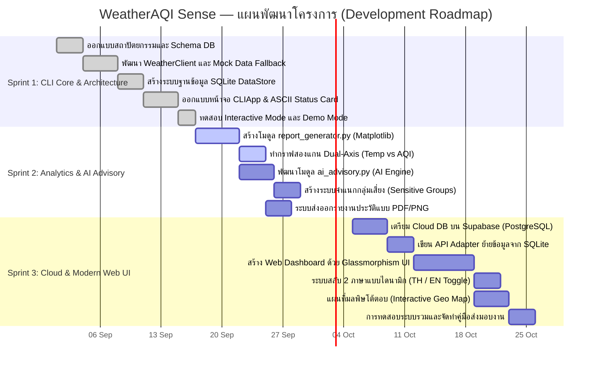

# WeatherAQI Sense — System Architecture & Flowchart Documentation
> **เอกสารแผนภาพสถาปัตยกรรมและการไหลของข้อมูลระบบ (System Architecture & Flowchart Specification)**  
> **โครงงาน:** WeatherAQI Sense (Weather & Air Quality Monitoring Dashboard)  
> **หมวดหมู่:** ซอฟต์แวร์ประยุกต์ด้านสิ่งแวดล้อมและสภาพภูมิอากาศ (Environmental & Weather Application)  
> **ระดับโครงการ:** Senior Project / Software Engineering Capstone Project  
> **สถานะโครงการ:** Sprint 1 Active (Sprint 2 & 3 Planned)

---

## สารบัญ (Table of Contents)
1. [ภาพรวมสถาปัตยกรรมระบบ (System Architecture Overview)](#1-ภาพรวมสถาปัตยกรรมระบบ-system-architecture-overview)
2. [ขั้นตอนการทำงานของผู้ใช้ - โหมดโต้ตอบ (User Flow: Interactive Mode)](#2-ขั้นตอนการทำงานของผู้ใช้---โหมดโต้ตอบ-user-flow-interactive-mode)
3. [ขั้นตอนการทำงานของผู้ใช้ - โหมดสาธิต (User Flow: Demo Mode)](#3-ขั้นตอนการทำงานของผู้ใช้---โหมดสาธิต-user-flow-demo-mode)
4. [แผนภาพการไหลของข้อมูล (Data Flow Diagram - DFD)](#4-แผนภาพการไหลของข้อมูล-data-flow-diagram---dfd)
5. [แผนภาพคลาสและความสัมพันธ์เชิงโครงสร้าง (Class Diagram)](#5-แผนภาพคลาสและความสัมพันธ์เชิงโครงสร้าง-class-diagram)
6. [โครงสร้างฐานข้อมูล (Database Schema & ER Diagram)](#6-โครงสร้างฐานข้อมูล-database-schema--er-diagram)
7. [แผนงานการพัฒนาตามสปรินต์ (Sprint Roadmap)](#7-แผนงานการพัฒนาตามสปรินต์-sprint-roadmap)
8. [ข้อกำหนดทางเทคนิคและการจัดการข้อผิดพลาด (Technical Specs & Defensive Architecture)](#8-ข้อกำหนดทางเทคนิคและการจัดการข้อผิดพลาด-technical-specs--defensive-architecture)

---

## 1. ภาพรวมสถาปัตยกรรมระบบ (System Architecture Overview)

ระบบ **WeatherAQI Sense** ถูกออกแบบตามหลักการ **Layered & Modular Architecture** โดยแยกความรับผิดชอบของส่วนรับส่งข้อมูลภายนอก (Data Acquisition), ชั้นตรรกะและการจัดเก็บ (Persistence & Logic), และชั้นการนำเสนอผลลัพธ์ (Presentation Layer) ออกจากกันอย่างชัดเจน พร้อมรองรับกลไก **Defensive Fallback Mechanism** ป้องกันระบบล่มเมื่อ API ภายนอกไม่พร้อมให้บริการ



---

## 2. ขั้นตอนการทำงานของผู้ใช้ - โหมดโต้ตอบ (User Flow: Interactive Mode)

โหมดโต้ตอบ (Interactive Mode) ช่วยให้ผู้ใช้สามารถค้นหาข้อมูลสภาพอากาศและคุณภาพอากาศของเมืองที่ต้องการได้แบบเรียลไทม์ พร้อมการตรวจสอบข้อมูลนำเข้า การแปลงข้อมูลให้เป็นรูปแบบมาตรฐาน และการแจ้งเตือนคำแนะนำสุขภาพทันที

```mermaid
flowchart TD
    START(["เริ่มต้นการทำงาน (Start App)"]) --> BANNER["แสดงผลแบนเนอร์ระบบ (Display ASCII Banner & Version)"]
    BANNER --> PROMPT[/ "รับข้อมูลชื่อเมืองจากผู้ใช้ (Prompt City Name)" /]
    
    PROMPT --> CHECK_EMPTY{"ผู้ใช้ป้อนค่าว่างหรือไม่?<br/>(Check Empty Input)"}
    CHECK_EMPTY -- "ใช่ (Empty)" --> WARN_EMPTY["แจ้งเตือน: กรุณากรอกชื่อเมือง<br/>(Show Warning)"]
    WARN_EMPTY --> PROMPT
    
    CHECK_EMPTY -- "ไม่ใช่ (Valid)" --> NORMALIZE["ทำความสะอาดข้อมูลนำเข้า (Normalize Input)<br/>• .strip() ตัดช่องว่างหัว-ท้าย<br/>• .lower() แปลงเป็นตัวพิมพ์เล็ก<br/>• Map ชื่อเมืองภาษาไทย/อังกฤษ"]
    
    NORMALIZE --> FETCH_API["ส่งคำขอข้อมูลผ่าน WeatherClient<br/>(Fetch Weather & AQI)"]
    
    FETCH_API --> API_EVAL{"ตรวจสอบสถานะ API Response<br/>(API Status OK?)"}
    
    API_EVAL -- "สำเร็จ (HTTP 200 & Valid Payload)" --> PARSE_LIVE["จัดเตรียม Snapshot จากข้อมูลสด<br/>(Process Live API Data)"]
    
    API_EVAL -- "ล้มเหลว (Network Err / Invalid Key / Rate Limit)" --> FALLBACK["เปิดใช้งาน Mock Data อัตโนมัติ<br/>(Defensive Fallback to Mock Data)"]
    FALLBACK --> WARN_FALLBACK["แสดงป้ายเตือน: [MOCK DATA MODE]<br/>(Notify User of Mock Mode)"]
    
    PARSE_LIVE --> MERGE_SNAP["รวมข้อมูลเป็นโครงสร้างมาตรฐาน (Unified Snapshot Dict)"]
    WARN_FALLBACK --> MERGE_SNAP
    
    MERGE_SNAP --> DB_SAVE["บันทึกข้อมูลลงฐานข้อมูล SQLite<br/>DataStore.save_record(snapshot)"]
    
    DB_SAVE --> ADVISORY_CALC["ประมวลผลคำแนะนำสุขภาพ<br/>get_simple_advisory(aqi, temp)"]
    
    ADVISORY_CALC --> PRINT_CARD["แสดงผลการ์ดสถานะ ASCII Status Card<br/>• กรอบ Unicode Box-drawing<br/>• ค่าอุณหภูมิ, ความชื้น, AQI, มลพิษหลัก<br/>• ข้อความแนะนำสุขภาพภาษาไทย"]
    
    PRINT_CARD --> LOOP_ASK{"ต้องการตรวจสอบเมืองอื่นต่อหรือไม่?<br/>(Continue Search? [Y/N])"}
    
    LOOP_ASK -- "Y / Yes (ทำต่อ)" --> PROMPT
    LOOP_ASK -- "N / No (ออก)" --> EXIT_MSG["แสดงข้อความขอบคุณและปิดโปรแกรม<br/>(Display Exit Message)"]
    EXIT_MSG --> FINISH(["สิ้นสุดการทำงาน (End)"])

    %% Styles
    classDef startEnd fill:#047857,stroke:#10b981,stroke-width:2px,color:#ffffff;
    classDef process fill:#1e293b,stroke:#64748b,stroke-width:1.5px,color:#f8fafc;
    classDef decision fill:#7c2d12,stroke:#f97316,stroke-width:2px,color:#ffffff;
    classDef warning fill:#831843,stroke:#f43f5e,stroke-width:2px,color:#ffffff;
    classDef output fill:#1e3a8a,stroke:#3b82f6,stroke-width:2px,color:#ffffff;

    class START,FINISH startEnd;
    class BANNER,NORMALIZE,FETCH_API,PARSE_LIVE,MERGE_SNAP,DB_SAVE,ADVISORY_CALC,EXIT_MSG process;
    class CHECK_EMPTY,API_EVAL,LOOP_ASK decision;
    class WARN_EMPTY,FALLBACK,WARN_FALLBACK warning;
    class PROMPT,PRINT_CARD output;
```

---

## 3. ขั้นตอนการทำงานของผู้ใช้ - โหมดสาธิต (User Flow: Demo Mode)

โหมดสาธิต (`python main.py --demo`) ถูกสร้างขึ้นเพื่อให้คณะกรรมการหรือผู้ตรวจโครงงานสามารถทดสอบความสามารถของระบบได้อย่างรวดเร็ว โดยระบบจะวนลูปดึงข้อมูลเมืองตัวแทน 3 ภูมิภาคหลักของประเทศไทย บันทึกลงฐานข้อมูล แสดงผลการ์ดสรุป และแสดงประวัติข้อมูลย้อนหลังทันที



---

## 4. แผนภาพการไหลของข้อมูล (Data Flow Diagram - DFD)

แผนภาพแสดงทิศทางการไหลและการแปลงสภาพของข้อมูลระหว่าง **External Entities (แหล่งข้อมูลภายนอก)**, **Processes (กระบวนการประมวลผล)**, และ **Data Stores (แหล่งเก็บข้อมูล)**



---

## 5. แผนภาพคลาสและความสัมพันธ์เชิงโครงสร้าง (Class Diagram)

โครงสร้างเชิงวัตถุ (Object-Oriented Design) ของโมดูลหลักในระบบ ประกอบด้วยคลาสจัดการข้อมูลภายนอก (`WeatherClient`), คลาสจัดการฐานข้อมูล (`DataStore`), และคลาสประสานงานหน้าจอผู้ใช้ (`CLIApp`) พร้อมฟังก์ชันอรรถประโยชน์อิสระ (`get_simple_advisory`)



### คำอธิบายโครงสร้างคลาส (Class Structure Details)
- **`WeatherClient` (`src/weather_client.py`)**:
  - รับผิดชอบการติดต่อผ่านเครือข่าย HTTP REST API ไปยัง OpenWeatherMap และ IQAir
  - ทำการ Wrap ค่า Exception และมีกลไกตรวจจับ Fallback อัตโนมัติ (`_mock_weather_data`, `_mock_aqi_data`) หากไม่พบคีย์ API หรือระบบขัดข้อง
- **`DataStore` (`src/data_store.py`)**:
  - ควบคุมการเชื่อมต่อ SQLite อย่างปลอดภัย โดยรันคำสั่ง `CREATE TABLE IF NOT EXISTS` อัตโนมัติเมื่อเริ่มต้นออบเจกต์
  - รองรับการบันทึก Snapshot และสืบค้นข้อมูลประวัติพร้อมจำกัดจำนวนแถวผลลัพธ์ (`limit`)
- **`CLIApp` (`src/cli_app.py`)**:
  - ควบคุมลำดับการแสดงผลผ่าน Terminal, ตรวจสอบและทำความสะอาด Input ของผู้ใช้
  - ผสานรวมข้อมูลผลลัพธ์สภาพอากาศ เข้ากับคำแนะนำของ `AdvisoryEngine` แล้วนำไปเรนเดอร์เป็นการ์ด ASCII
- **`get_simple_advisory(aqi, temp)`**:
  - ฟังก์ชันประเมินระดับดัชนีคุณภาพอากาศ (US AQI Standard) และสภาพอุณหภูมิ เพื่อคืนค่าคำแนะนำด้านสุขภาพภาษาไทยที่เหมาะสมกับประชาชนทั่วไปและกลุ่มเสี่ยง

---

## 6. โครงสร้างฐานข้อมูล (Database Schema & ER Diagram)

ระบบใช้ฐานข้อมูล **SQLite** ในการจัดเก็บข้อมูลเบื้องต้น (`data/weather_data.db`) โดยมีตารางหลักคือ `metrics` พร้อมรองรับการขยายสถาปัตยกรรมสู่ **Supabase PostgreSQL** ใน Sprint 3



### รายละเอียดพจนานุกรมข้อมูล (Data Dictionary for `metrics` Table)

| ฟิลด์ (Field Name) | ชนิดข้อมูล (Type) | คีย์ (Key) | ค่าว่าง (Null) | คำอธิบายภาษาไทย (Description) | ตัวอย่างข้อมูล (Example) |
| :--- | :--- | :---: | :---: | :--- | :--- |
| `id` | `INTEGER` | **PK** | No | ลำดับรหัสรายการ (Auto Increment) | `1`, `2`, `3` |
| `timestamp` | `TEXT` | - | No | เวลาที่ทำการบันทึกข้อมูล (ISO-8601 Format) | `2026-09-15 09:30:00` |
| `city` | `TEXT` | IDX | No | ชื่อเมืองที่ตรวจวัด (Normalized Capital Case) | `"Bangkok"`, `"Khon Kaen"` |
| `temp` | `REAL` | - | No | อุณหภูมิอากาศ ณ จุดตรวจวัด (องศาเซลเซียส) | `32.5` |
| `humidity` | `REAL` | - | No | ความชื้นสัมพัทธ์ในอากาศ (เปอร์เซ็นต์ %) | `68.0` |
| `pressure` | `REAL` | - | Yes | ความกดอากาศสัมพัทธ์ระดับน้ำทะเล (hPa) | `1012.4` |
| `description` | `TEXT` | - | Yes | รายละเอียดสภาพท้องฟ้าและสภาพอากาศ | `"few clouds"`, `"light rain"` |
| `aqi` | `INTEGER` | - | Yes | ดัชนีคุณภาพอากาศมาตรฐานสากล (US AQI) | `45`, `112`, `165` |
| `aqi_category` | `TEXT` | - | Yes | ระดับความเสี่ยงต่อสุขภาพตามเกณฑ์มาตรฐาน | `"Moderate"`, `"Unhealthy"` |
| `main_pollutant`| `TEXT` | - | Yes | สารมลพิษหลักที่เป็นตัวกำหนดค่า AQI | `"pm25"`, `"pm10"`, `"o3"` |

> [!TIP]
> **การปรับปรุงประสิทธิภาพฐานข้อมูล (Database Indexing Recommendation):**  
> ในการใช้งานจริง แนะนำให้สร้าง Index แบบผสม `CREATE INDEX idx_city_time ON metrics(city, timestamp DESC);` เพื่อเพิ่มความเร็วในการสืบค้นประวัติย้อนหลังของแต่ละเมืองสำหรับโมดูลพล็อตกราฟใน Sprint 2

---

## 7. แผนงานการพัฒนาตามสปรินต์ (Sprint Roadmap)

แผนงานการพัฒนาโครงงานแบ่งออกเป็น 3 สปรินต์หลัก โดยเริ่มจากรากฐาน Command-Line Interface ที่มั่นคง การเสริมขีดความสามารถด้านการวิเคราะห์ภาพและปัญญาประดิษฐ์ ไปจนถึงการยกระดับสู่เว็บแอปพลิเคชันระดับคลาวด์



### ไทม์ไลน์สรุปตามสปรินต์ (Sprint Progression Highlights)

```mermaid
journey
    title เส้นทางการพัฒนาโครงงาน WeatherAQI Sense (Project Evolution)
    section Sprint 1: รากฐานระบบ (Foundation)
      รับส่งคำสั่งผ่านคอนโซล (CLI Interface) : 5: นักพัฒนา
      เชื่อมต่อ 2 APIs (OpenWeather + IQAir) : 4: นักพัฒนา
      ระบบสำรองข้อมูลฉุกเฉิน (Mock Fallback) : 5: นักพัฒนา, ผู้ใช้
      บันทึกข้อมูลท้องถิ่น (SQLite Persistence) : 5: นักพัฒนา
    section Sprint 2: การวิเคราะห์และปัญญาประดิษฐ์ (Intelligence)
      พล็อตกราฟสถิติสองแกน (Dual-Axis Charts) : 4: นักวิเคราะห์
      คำแนะนำเชิงลึกจาก AI (AI Health Advisory) : 4: ผู้ใช้, ผู้เชี่ยวชาญ
      การประเมินความเสี่ยงรายกลุ่ม (Risk Assessment) : 4: ผู้ใช้
    section Sprint 3: ประสบการณ์ผู้ใช้ขั้นสูง (Modern Experience)
      เชื่อมต่อคลาวด์ (Supabase Cloud Migration) : 5: นักพัฒนา
      อินเทอร์เฟซกระจกโปร่งแสง (Glassmorphism Web UI) : 5: ผู้ใช้
      รองรับสองภาษาไทย-อังกฤษ (Bilingual TH/EN) : 5: ผู้ใช้สากล
```

---

## 8. ข้อกำหนดทางเทคนิคและการจัดการข้อผิดพลาด (Technical Specs & Defensive Architecture)

### 8.1 Defensive Fallback Strategy (ยุทธศาสตร์การป้องกันความล้มเหลว)
เพื่อให้ระบบมีเสถียรภาพสูงสุดในการตรวจประเมินผลการเรียนการสอนและนำไปใช้งานจริง ระบบได้ออกแบบกลไกป้องกันข้อผิดพลาด 3 ระดับ:

1. **Missing API Keys Protection:**  
   หากไม่มีการตั้งค่า `OWM_API_KEY` หรือ `IQAIR_API_KEY` ในสภาพแวดล้อมระบบ ตัวโปรแกรมจะไม่ขัดข้องหรือเกิด Unhandled Exception แต่จะสลับไปดึงข้อมูลจำลองจาก `_mock_weather_data()` และ `_mock_aqi_data()` ทันที พร้อมแสดงสัญลักษณ์ `[MOCK MODE]` บนหน้าจอ
2. **Network Timeout & Connection Refusal Handling:**  
   ใช้การดักจับข้อผิดพลาด `requests.exceptions.RequestException` และกำหนดค่า `timeout` อย่างเคร่งครัด (5-10 วินาที) ป้องกันไม่ให้หน้าจอ Terminal ค้าง
3. **HTTP 429 Rate-Limit Mitigation:**  
   เนื่องจากบริการฟรีของ IQAir มีการจำกัดโควตาการเรียกใช้งานต่อนาที/วัน เมื่อพบรหัสสถานะ `429 Too Many Requests` ระบบจะแจ้งเตือนผู้ใช้อย่างสุภาพและดึงค่าล่าสุดจากฐานข้อมูล SQLite ในเครื่องมาแสดงผลแทน

### 8.2 เกณฑ์การแปลผลดัชนีคุณภาพอากาศ (US AQI Health Breakpoints)
ระบบของ `get_simple_advisory()` อ้างอิงตามมาตรฐาน US EPA:

| ช่วงค่า AQI | ระดับคุณภาพอากาศ | สัญลักษณ์สี | คำแนะนำทางสุขภาพภาษาไทย (Health Advisory) |
| :---: | :---: | :---: | :--- |
| **0 - 50** | ดีมาก (Good) | 🟢 เขียว | อากาศบริสุทธิ์ เหมาะสำหรับกิจกรรมกลางแจ้งทุกประเภท |
| **51 - 100** | ปานกลาง (Moderate) | 🟡 เหลือง | คุณภาพอากาศยอมรับได้ ผู้มีอาการภูมิแพ้ควรเฝ้าระวังอาการเบื้องต้น |
| **101 - 150** | เริ่มมีผลต่อสุขภาพ (Unhealthy for Sensitive) | 🟠 ส้ม | เด็ก ผู้สูงอายุ และผู้ป่วยทางเดินหายใจ ควรลดกิจกรรมกลางแจ้ง |
| **151 - 200** | มีผลกระทบต่อสุขภาพ (Unhealthy) | 🔴 แดง | ทุกคนควรหลีกเลี่ยงกิจกรรมกลางแจ้ง และสวมหน้ากากป้องกันฝุ่น N95 |
| **201 - 300** | มีผลกระทบต่อสุขภาพมาก (Very Unhealthy) | 🟣 ม่วง | เตือนภัยสุขภาพ! งดกิจกรรมกลางแจ้งเด็ดขาด และเปิดเครื่องฟอกอากาศ |
| **301+** | อันตรายร้ายแรง (Hazardous) | 🟤 น้ำตาลเข้ม | ภาวะฉุกเฉินด้านมลพิษ อยู่ภายในอาคารปิดมิดชิดตลอดเวลา |

---

*เอกสารฉบับนี้จัดทำขึ้นสำหรับโครงการ WeatherAQI Sense — เพื่อใช้ประกอบการประเมินโครงงานวิศวกรรมซอฟต์แวร์และการพัฒนาโปรแกรมต่อเนื่อง*
