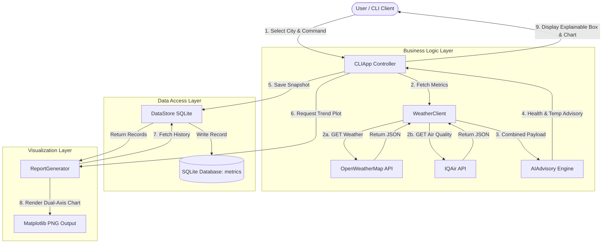

# System Architecture & Workflow Flowchart

Below is the architectural data flow diagram for the **Weather & Air Quality Dashboard**, illustrating interactions between the Presentation CLI Layer, Business Logic Layer, Data Persistence Layer, and External APIs.

