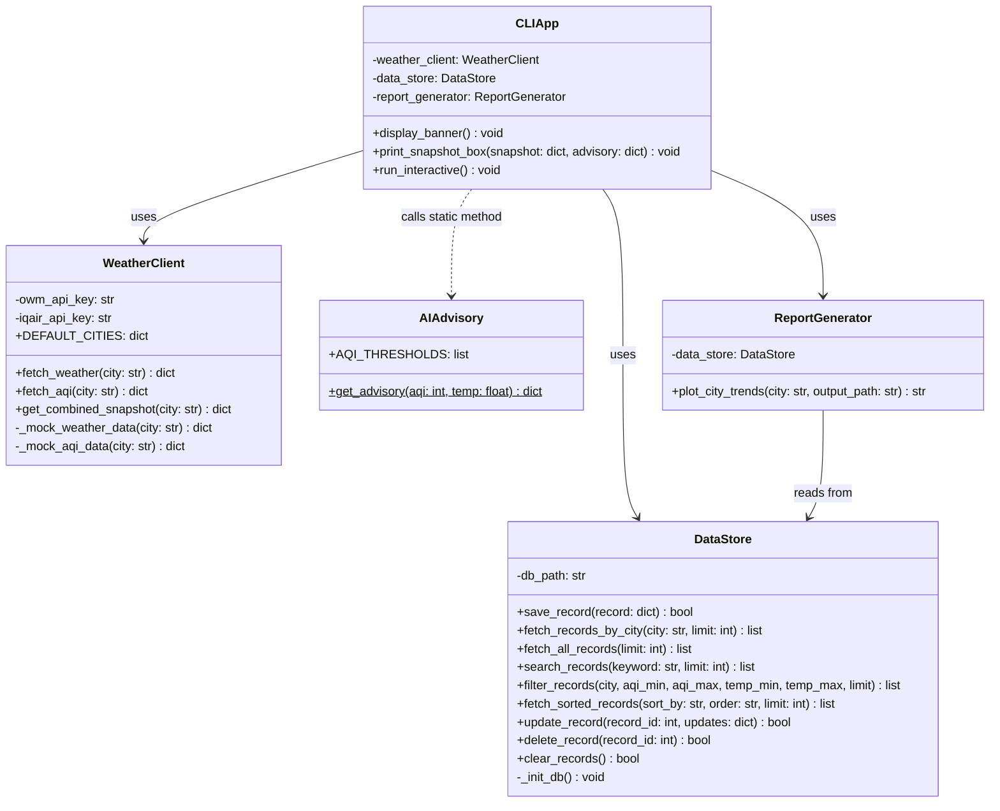

# 📋 PLAN.md — WeatherAQI Sense Project Architecture & Planning Document

**โปรเจกต์:** WeatherAQI Sense — ระบบแดชบอร์ดติดตามสภาพอากาศและคุณภาพอากาศ  
**รายวิชา:** CP352301 การเขียนโปรแกรมสคริปต์ (1/2569)  
**อาจารย์ผู้สอน:** ผศ. บุญสืบ ไวคำ  

---

## 👥 สมาชิกในทีมและบทบาทหมุนเวียน

| สมาชิก | Sprint 1 | Sprint 2 | Sprint 3 |
|:---|:---:|:---:|:---:|
| **นางสาวสหกานต์ธีรา สังข์ขาว (ผักกาด)** | Planner / Architect | Coder / Dev | Debugger / QA |
| **นายปิยภัทร รัตนรักษ์ (พัตเตอร์)** | Coder / Dev | Debugger / QA | Planner / Architect |
| **นายอัษฎาวุธ เรือนแก้ว (กล้า)** | Debugger / QA | Planner / Architect | Coder & DevOps |

---

## 🏗️ UML Class Diagram (สถาปัตยกรรมเชิงวัตถุ)



---

## 🗃️ Data Schema

### SQLite — ตาราง `metrics` (Local Persistence)

| คอลัมน์ | ประเภท | คำอธิบาย |
|:---|:---|:---|
| `id` | INTEGER PRIMARY KEY AUTOINCREMENT | รหัสเรคอร์ด |
| `timestamp` | TEXT NOT NULL | วันเวลาที่บันทึก |
| `city` | TEXT NOT NULL | ชื่อเมือง |
| `temp` | REAL NOT NULL | อุณหภูมิ (°C) |
| `humidity` | REAL NOT NULL | ความชื้น (%) |
| `pressure` | REAL | ความกดอากาศ (hPa) |
| `description` | TEXT | คำอธิบายสภาพอากาศ |
| `aqi` | INTEGER NOT NULL | ดัชนีคุณภาพอากาศ (US AQI) |
| `main_pollutant` | TEXT | สารมลพิษหลัก (เช่น p2 = PM2.5) |

### Supabase Cloud — ตาราง `weather_aqi_cache`

| คอลัมน์ | ประเภท | คำอธิบาย |
|:---|:---|:---|
| `id` | BIGSERIAL PRIMARY KEY | รหัสเรคอร์ด |
| `city_key` | TEXT NOT NULL UNIQUE | คีย์จังหวัด (เช่น "bangkok") |
| `city_name_th` / `city_name_en` | TEXT | ชื่อจังหวัดไทย/อังกฤษ |
| `lat` / `lon` | NUMERIC | พิกัดภูมิศาสตร์ |
| `temperature` | NUMERIC(5,1) | อุณหภูมิ (°C) |
| `humidity` | INTEGER | ความชื้น (%) |
| `wind_speed` | NUMERIC(5,1) | ความเร็วลม (km/h) |
| `weather_code` | INTEGER | รหัสสภาพอากาศ WMO |
| `aqi` | INTEGER | ดัชนี US AQI |
| `pm25` | NUMERIC(6,1) | ค่าฝุ่น PM2.5 (µg/m³) |
| `hourly_labels` / `hourly_temps` / `hourly_aqis` | JSONB | ข้อมูลรายชั่วโมง |
| `fetched_at` / `created_at` / `updated_at` | TIMESTAMPTZ | Timestamps |

---

## ✅ Definition of Done (DoD) — แต่ละ Sprint

### Sprint 1: Core System Foundation & OOP CLI
- [x] สร้างโครงสร้าง OOP แยกโมดูลชัดเจน (`WeatherClient`, `DataStore`, `CLIApp`)
- [x] ดึงข้อมูล Weather + AQI จาก API พร้อมระบบ Defensive Fallback
- [x] จัดเก็บข้อมูลลง SQLite3 ได้อัตโนมัติ
- [x] CLI Interface รับอินพุต, แสดง ASCII Box Report, ดูประวัติย้อนหลัง
- [x] Health Advisory (Rule-Based) แสดงคำแนะนำสุขภาพ
- [x] โหมด Interactive + `--demo` ทำงานครบ
- [x] Unit Tests ผ่าน 100%

### Sprint 2: Back-End Enhancement & Cloud Migration
- [x] ย้ายฐานข้อมูลจาก SQLite → Supabase Cloud Database (PostgreSQL)
- [x] กราฟ Matplotlib Dual-Axis (Temp vs AQI) — `ReportGenerator`
- [x] AI Advisory Module วิเคราะห์ 6 ระดับ AQI + อุณหภูมิ
- [x] **ฟังก์ชันค้นหา (Search)** — ค้นหาเรคอร์ดตามคำค้น (ชื่อเมือง/คำอธิบาย)
- [x] **ฟังก์ชันกรอง (Filter)** — กรองหลายเงื่อนไข (AQI range, Temp range, City)
- [x] **ฟังก์ชันเรียงลำดับ (Sort)** — เรียงตามคอลัมน์ (aqi, temp, timestamp, city)
- [x] **CRUD ครบ 4 ตัว** — Create, Read, Update, Delete
- [x] บันทึก AI Prompt Logs ใน `learning_log.ipynb` และ `LEARNINGLOG.md`

### Sprint 3: Web Dashboard & Deployment
- [x] Web Dashboard (Glassmorphism UI) — 78 จังหวัดทั่วประเทศไทย
- [x] รองรับ 2 ภาษา (TH/EN Toggle)
- [x] Live API (Open-Meteo) ดึงข้อมูลสดบนเบราว์เซอร์
- [x] ระบบ Cache ผ่าน Supabase พร้อม Auto-Refresh (GitHub Actions Cron)
- [x] GitHub Pages Deployment (CI/CD) — `.github/workflows/static.yml`
- [x] CI/CD Workflow รัน Linting (flake8) + Unit Test (pytest) — `.github/workflows/ci.yml`
- [x] QA & Testing: Edge Case Tests ครอบคลุม (31 เคส)

---

## 🏛️ สถาปัตยกรรมระบบ 3 ชั้น (3-Layer Architecture)

```
┌─────────────────────────────────────────────────────┐
│              PRESENTATION LAYER                     │
│                                                     │
│  ┌──────────────┐  ┌─────────────────────────────┐  │
│  │  CLIApp       │  │  Web Dashboard (index.html) │  │
│  │  (cli_app.py) │  │  Glassmorphism UI + TH/EN   │  │
│  └──────┬───────┘  └──────────┬──────────────────┘  │
├─────────┼──────────────────────┼─────────────────────┤
│         │   BUSINESS LOGIC LAYER                    │
│         │                      │                    │
│  ┌──────▼───────┐  ┌──────────▼──────────────────┐  │
│  │ WeatherClient │  │ AIAdvisory + ReportGenerator│  │
│  │ (API Gateway) │  │ (Health Analysis + Charts)  │  │
│  └──────┬───────┘  └──────────┬──────────────────┘  │
├─────────┼──────────────────────┼─────────────────────┤
│         │   DATA ACCESS LAYER                       │
│         │                      │                    │
│  ┌──────▼───────┐  ┌──────────▼──────────────────┐  │
│  │  DataStore    │  │  Supabase Cloud Database    │  │
│  │  (SQLite3)    │  │  (PostgreSQL + REST API)    │  │
│  └──────────────┘  └─────────────────────────────┘  │
└─────────────────────────────────────────────────────┘
```

### หลักการออกแบบ:
- **Separation of Concerns (SoC):** แต่ละโมดูลรับผิดชอบงานเดียว
- **Single Responsibility Principle (SRP):** ทุกคลาสมีหน้าที่เดียวชัดเจน
- **Defensive Programming:** ระบบ Mock Fallback ป้องกันแอปพลิเคชันล่ม 100%
- **Parameterized Queries:** ป้องกัน SQL Injection ด้วย `?` placeholder

---

## 🔄 ประวัติการ Refactor โค้ด (Refactoring History)

ตามข้อกำหนดใน Deliverables Matrix (Sprint 2–3) สรุปประวัติการปรับปรุงโครงสร้างโค้ดสำคัญ:

| ลำดับ | โมดูลที่ Refactor | ปัญหาที่พบ (Issue) | วิธีการแก้ไข (Solution) | ผลลัพธ์ |
|:---:|:---|:---|:---|:---|
| **RF-01** | `src/weather_client.py` | API Key หมดโควตา / เชื่อมต่อหลุดทำให้แอปพัง | เพิ่มระบบ Mock Fallback ครอบ `try-except` ทุกจุดเชื่อมต่อ API | แอปพลิเคชันรันต่อได้ 100% ไม่ crash |
| **RF-02** | `src/data_store.py` | ขาดฟังก์ชัน Search, Filter, Sort และ CRUD ไม่ครบ (ไม่มี Update/Delete) | เพิ่ม 5 เมธอดใหม่: `search_records`, `filter_records`, `fetch_sorted_records`, `update_record`, `delete_record` | รองรับ CRUD ครบ 4 ตัว และประมวลผลข้อมูลแม่นยำ |
| **RF-03** | `src/cli_app.py` | `print_snapshot_box` เข้าถึง dictionary ด้วย `[]` เกิด `KeyError` เมื่อขาดคีย์ | Refactor เป็น `.get(key, default)` พร้อม fallback ทุกฟิลด์ | ทนทานต่อข้อมูลไม่สมบูรณ์ (Defensive Access) |
| **RF-04** | `src/data_store.py` | SQLite บน Local ไม่สามารถเชื่อมต่อกับ Web Dashboard บน GitHub Pages | ออกแบบตาราง `weather_aqi_cache` บน Supabase PostgreSQL และสร้างสคริปต์ Sync | รองรับทั้ง Desktop CLI (SQLite) และ Web Cloud (Supabase) |
| **RF-05** | `tests/` | ขาดการทดสอบกรณีขอบเขต (Edge Cases) และ boundary values | เพิ่ม `tests/test_cli.py` (18 เทส) และ `tests/test_edge_cases.py` (37 เทส) | เทสผ่าน 100% รวม 62 เทส ครอบคลุมทุกขอบเขต |

---

## 💡 สรุปบทเรียนประจำสัปดาห์ (Retrospective: Wow! & Whoops!)

### 🌟 Wow! (ส่วนที่ทำได้ดี)
1. **Modular Layer Separation:** สถาปัตยกรรม 3 ชั้นช่วยให้สมาชิกหมุนเวียนบทบาทและทำงานคู่ขนานกันได้อย่างมีประสิทธิภาพ ไม่เกิด merge conflicts
2. **Defensive Programming Excellence:** ระบบมี Fallback Data สำรองทุกจุด ทำให้เวลา Live Demo ไม่มีทางเกิด Unhandled Exception
3. **Full-Stack & Cloud Integration:** ยกระดับจากแค่ Python CLI ไปสู่ Web Dashboard สไตล์ Glassmorphism บน GitHub Pages ดึง Live API จริง 78 จังหวัดทั่วไทย

### ⚠️ Whoops! (ปัญหาที่พบและการแก้ไข)
1. **Missing Dictionary Keys:** `print_snapshot_box` พังเมื่อส่ง dictionary ขาดบางคีย์ → แก้ไขโดยใช้ `.get()` แบบ Defensive ทั้งหมด
2. **Windows File Locking:** Unit Test สำหรับ SQLite ลบไฟล์ชั่วคราวไม่ได้บน Windows ติด `PermissionError` → ครอบ `try-except PermissionError` ตอนลบ temp file
3. **Flake8 Line Length:** ข้อมูลพิกัด 78 จังหวัดใน `refresh_provinces.py` เกิน 120 ตัวอักษร → ปรับคอนฟิก `.github/workflows/ci.yml` ให้ exclude ไฟล์ข้อมูลเฉพาะจุด และจัดระเบียบโค้ดส่วนอื่นจน flake8 ผ่าน 0 errors

