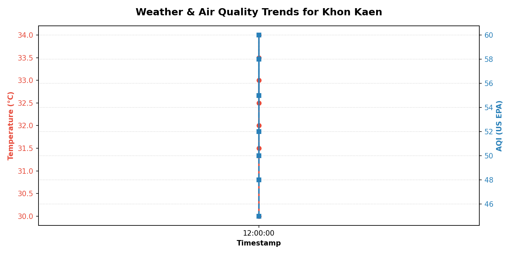

# 📦 Sprint 2: Back-End App Dev & Cloud Migration

**ส่งงาน:** สัปดาห์ที่ 13 | **กำหนดส่ง:** 25/9/2569

---

## 🎯 เป้าหมาย Sprint 2
พัฒนา Business Logic Layer (BLL) และ Data Access Layer (DAL) ให้สมบูรณ์ — Search, Filter, Sort, CRUD ครบ, Supabase Cloud Migration, AI Advisory, Chart Generator

---

## ✅ Deliverables ที่ส่งมอบ

### 1. 🔍 Data Processing Algorithms (อัลกอริทึมประมวลผลข้อมูล)

| อัลกอริทึม | เมธอดใน DataStore | คำอธิบาย |
|:---|:---|:---|
| **Search (ค้นหา)** | `search_records(keyword, limit)` | ค้นหาเรคอร์ดตามคำค้น — match ชื่อเมืองหรือคำอธิบาย ด้วย SQL `LIKE` |
| **Filter (กรอง)** | `filter_records(city, aqi_min, aqi_max, temp_min, temp_max, limit)` | กรองข้อมูลหลายเงื่อนไขพร้อมกัน — เมือง, ช่วง AQI, ช่วงอุณหภูมิ |
| **Sort (เรียงลำดับ)** | `fetch_sorted_records(sort_by, order, limit)` | เรียงลำดับตามคอลัมน์ (aqi, temp, timestamp, city, humidity, pressure) ได้ทั้ง ASC/DESC |

### 2. ✏️ CRUD Operations ครบ 4 ตัว

| Operation | เมธอดใน DataStore | คำอธิบาย |
|:---|:---|:---|
| **Create** | `save_record(record)` | บันทึกข้อมูล snapshot ลง SQLite |
| **Read** | `fetch_all_records()`, `fetch_records_by_city()` | ดึงข้อมูลทั้งหมดหรือตามเมือง |
| **Update** | `update_record(record_id, updates)` | แก้ไขเรคอร์ดตาม ID — อนุญาตเฉพาะฟิลด์ที่กำหนด |
| **Delete** | `delete_record(record_id)` | ลบเรคอร์ดตาม ID พร้อมตรวจสอบว่ามีอยู่จริง |

### 3. ☁️ Cloud Database Migration (Supabase)
- **Schema:** `supabase_schema.sql` — ตาราง `weather_aqi_cache` บน PostgreSQL
- **Sync Script:** `src/sync_supabase.py` — ดึง 78 จังหวัด → upsert ลง Supabase
- **Async Refresh:** `src/refresh_provinces.py` — ดึงข้อมูลแบบ async ด้วย aiohttp

### 4. 📈 Dual-Axis Chart Generator
- **ไฟล์:** `src/report_generator.py`
- พล็อต Matplotlib กราฟ 2 แกน Y: Temperature (°C) vs AQI
- Export เป็น PNG อัตโนมัติ: `Sprint2/trend_khon_kaen.png`



### 5. 🧠 AI Health Advisory Module
- **ไฟล์:** `src/ai_advisory.py`
- 6 ระดับ AQI: Good → Moderate → Unhealthy for Sensitive → Unhealthy → Very Unhealthy → Hazardous
- คำแนะนำอุณหภูมิ: Cool Notice (≤18°C), Comfortable (18.1-34.9°C), Heat Warning (≥35°C)

### 6. 🖥️ Expanded CLI Menu (5 → 10 ตัวเลือก)
```
--- MAIN MENU ---
1.  Fetch & Record Live Weather & AQI
2.  View Saved History Records
3.  Generate & View Matplotlib Trend Chart
4.  Launch Web Dashboard
5.  🔍 Search Records by Keyword        ← ใหม่
6.  🔎 Filter Records (AQI / Temp Range) ← ใหม่
7.  📊 Sort & Display Records            ← ใหม่
8.  ✏️  Update a Record                   ← ใหม่
9.  🗑️  Delete a Record                   ← ใหม่
10. Exit Application
```

### 7. 📋 Architecture Document
- **ไฟล์:** `PLAN.md`
- UML Class Diagram (Mermaid) — 5 คลาสพร้อม relationships
- Data Schema (SQLite + Supabase)
- Definition of Done ทุก Sprint

---

## 👥 บทบาทสมาชิก Sprint 2

| สมาชิก | บทบาท | งานที่ทำ |
|:---|:---:|:---|
| **ผักกาด** | Coder | เขียน Supabase migration, Report Generator, AI Advisory Module |
| **พัตเตอร์** | Debugger | ทดสอบ API fallbacks, Database integrity, Edge cases |
| **กล้า** | Planner | ออกแบบ Cloud Schema, กำหนด Sprint 2 DoD, ประสานงาน Integration |

---

## 📝 Changelog — Sprint 2

### [v0.2.0] - Sprint 2: Back-End App Dev & Cloud Migration
#### Added
- **Cloud Database Migration:** SQLite → Supabase PostgreSQL (`supabase_schema.sql`, `src/sync_supabase.py`)
- **Dual-Axis Chart Generator:** Matplotlib trend plot Temp vs AQI (`src/report_generator.py`)
- **AI Health Advisory Module:** Rule-based 6-level AQI + Temp warnings (`src/ai_advisory.py`)
- **Search Algorithm:** `DataStore.search_records(keyword)` — keyword search across city names and descriptions
- **Filter Algorithm:** `DataStore.filter_records()` — multi-criteria filtering (city, AQI range, temp range)
- **Sort Algorithm:** `DataStore.fetch_sorted_records()` — sort by any column in asc/desc order
- **CRUD Complete:** Added `update_record(id, updates)` and `delete_record(id)` to DataStore
- **Expanded CLI Menu:** 10 options including Search (5), Filter (6), Sort (7), Update (8), Delete (9)
- **PLAN.md:** UML Class Diagram, Data Schema, Definition of Done
- **Learning Log:** AI prompt logs in `LEARNINGLOG.md`

---

## 📂 ไฟล์ที่เพิ่ม/แก้ไขใน Sprint 2
```
src/
├── data_store.py        ← เพิ่ม search_records, filter_records, fetch_sorted_records,
│                           update_record, delete_record (CRUD ครบ)
├── cli_app.py           ← ขยายเมนู 5 → 10 ตัวเลือก
├── ai_advisory.py       ← เพิ่ม AQI 6-level classification + Temp advisory
├── report_generator.py  ← เพิ่ม Dual-Axis Chart (Matplotlib)
├── sync_supabase.py     ← สร้างใหม่ — Supabase upsert 78 จังหวัด
└── refresh_provinces.py ← สร้างใหม่ — Async refresh ด้วย aiohttp

PLAN.md                  ← สร้างใหม่ — UML + Schema + DoD
supabase_schema.sql      ← สร้างใหม่ — Cloud database schema
CHANGELOG.md             ← เพิ่ม Sprint 2 entries
LEARNINGLOG.md           ← บันทึก AI Prompts
```
